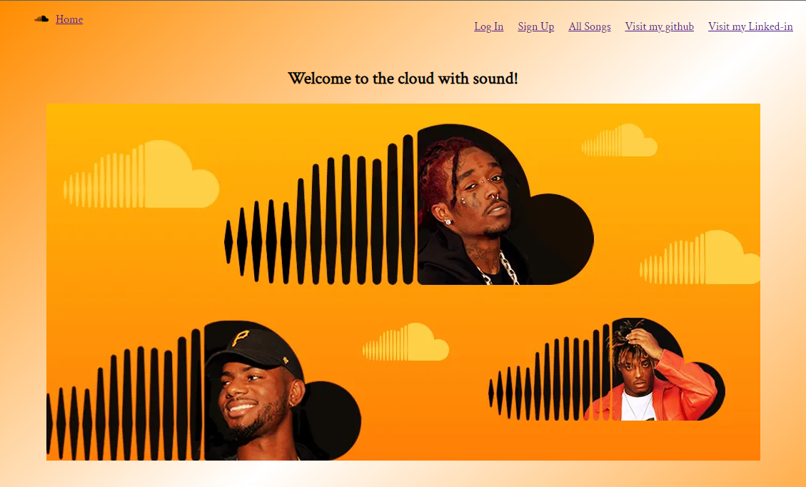

# `Welome to my soundcloud clone (Issa Cloud with Sound)`
this is my first attempt at building a web page which currently has two features, Songs & Comments that both have full CRUD functionality

to get started you are going to want to download the zip file and unzip it wherever you would like. Alternatively you can do a git clone instead

then you will need to run an npm install for all dependancies

next create a .env file at the root of the backend folder where you can copy and paste in the following code ->
```json
PORT=8000
DB_FILE=db/dev.db
JWT_SECRET=
JWT_EXPIRES_IN=604800
SCHEMA=scProject
```

for the "JWT_SECRET" you will want to have a string value of a JWT that you have generated

next, in the backend directory of your terminal run the command "npm run rebuild"
which will migrate and seed all Models.

lastly you will want to open the terminal under the backend folder and run "npm Start" ... then do the same for the frontend and it will automatically open up the homepage of the app in your web browser which should look like the image below

Enjoy :)



